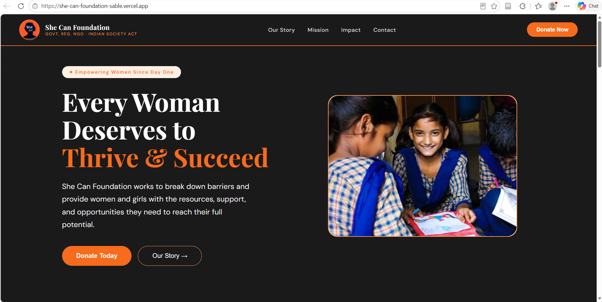
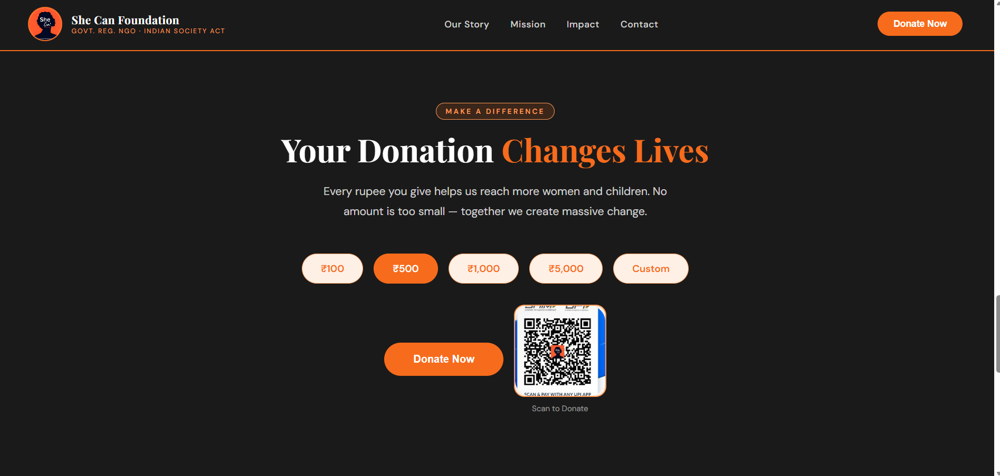
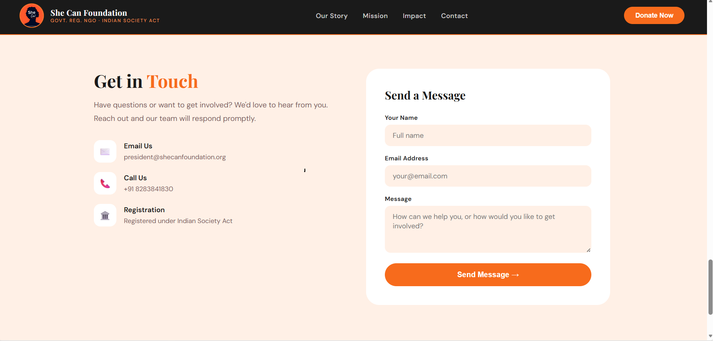

# She Can Foundation Website

A responsive foundation website built using HTML, CSS, and JavaScript.

## Live Demo

https://she-can-foundation-sable.vercel.app/

---

## Features

* Responsive modern UI
* Hero section
* NGO mission and impact sections
* Donation section with QR code
* Smooth scrolling animations
* Contact section
* Mobile-friendly design

---

##  Technologies Used

* HTML5
* CSS3
* JavaScript

---

 Project Structure
project/
│
├── index.html
├── style.css
├── script.js
├── README.md
│
├── images/
│   ├── logo.png
│   ├── qr.png
│   ├── bg_pic.jpg
│   ├── team.jpg
│   └── weneed.webp
│
└── screenshots/
    ├── home.png
    ├── donate.png
    └── GetInTouch.png

---

## Screenshots

### Home Page

---

### Donation Section

---

### Contact Section

---

## Author

Simran Singh

GitHub: https://github.com/sssimransingh26-bit/She-Can-Foundation
